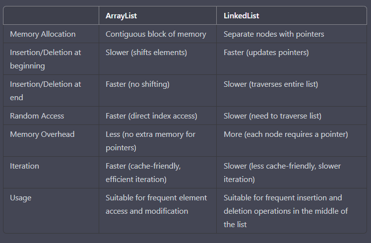

**ArrayList vs LinkedList**

Comparison between ArrayList and LinkedList in tabular form:

Overall, ArrayList is better suited for situations where you need frequent element access and modification, 
while LinkedList is better suited for situations where you need frequent insertion and deletion operations 
in the middle of the list. 
However, the best choice depends on the specific use case and the size of the list being manipulated.

