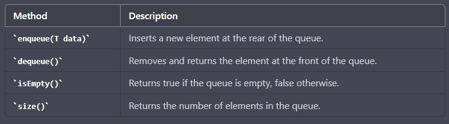
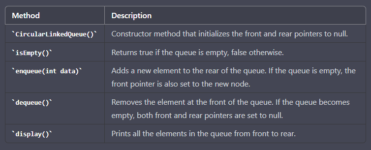

**CircularLinkedQueue for batch processing in java**

A circular linked queue is a data structure that allows elements to be inserted 
at the rear and removed from the front of the queue. It is circular in nature, 
which means that the last element of the queue is connected to the first element of the queue.

Here's an implementation of a CircularLinkedQueue in Java for batch processing:

public class CircularLinkedQueue<T> {

  private Node<T> rear;
  private int size;

  public void enqueue(T data) {
    Node<T> newNode = new Node<>(data);

    if (rear == null) {
      rear = newNode;
      rear.setNext(rear);
    } else {
      Node<T> front = rear.getNext();
      rear.setNext(newNode);
      newNode.setNext(front);
      rear = newNode;
    }

    size++;
  }

  public T dequeue() {
    if (rear == null) {
      throw new NoSuchElementException();
    }

    Node<T> front = rear.getNext();
    if (front == rear) {
      rear = null;
    } else {
      rear.setNext(front.getNext());
    }

    size--;
    return front.getData();
  }

  public boolean isEmpty() {
    return rear == null;
  }

  public int size() {
    return size;
  }

  private static class Node<T> {
    private final T data;
    private Node<T> next;

    public Node(T data) {
      this.data = data;
    }

    public T getData() {
      return data;
    }

    public Node<T> getNext() {
      return next;
    }

    public void setNext(Node<T> next) {
      this.next = next;
    }
  }
}

This implementation uses a Node class to represent each element in the queue. 
The enqueue method adds a new element to the rear of the queue, 
while the dequeue method removes the element from the front of the queue. 
The isEmpty method checks whether the queue is empty, 
and the size method returns the number of elements in the queue.

With this data structure, you can implement batch processing by enqueuing a batch of elements and 
then dequeueing them one by one for processing. 
This is useful when you have a large number of elements to process and want to avoid processing them all at once, 
which can cause memory or performance issues.

Note that the enqueue and dequeue operations in a CircularLinkedQueue have a time complexity of O(1), 
which makes this data structure efficient for implementing a queue.
