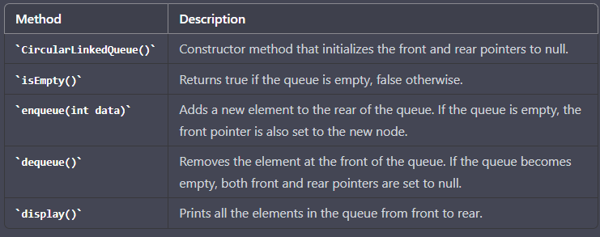

**implementation of a CircularLinkedQueue in Java using a tabular form**

Note that the enqueue and dequeue operations in a CircularLinkedQueue have a time complexity of O(1), 
which makes this data structure efficient for implementing a queue.

public class Node {
    int data;
    Node next;

    public Node(int data) {
        this.data = data;
        this.next = null;
    }
}

public class CircularLinkedQueue {
    private Node front;
    private Node rear;

    public CircularLinkedQueue() {
        front = null;
        rear = null;
    }

    public boolean isEmpty() {
        return (front == null && rear == null);
    }

    public void enqueue(int data) {
        Node newNode = new Node(data);
        if (isEmpty()) {
            front = newNode;
        } else {
            rear.next = newNode;
        }
        rear = newNode;
        rear.next = front;
    }

    public void dequeue() {
        if (isEmpty()) {
            System.out.println("Queue is empty");
        } else if (front == rear) {
            front = null;
            rear = null;
        } else {
            front = front.next;
            rear.next = front;
        }
    }

    public void display() {
        if (isEmpty()) {
            System.out.println("Queue is empty");
        } else {
            Node temp = front;
            do {
                System.out.print(temp.data + " ");
                temp = temp.next;
            } while (temp != front);
            System.out.println();
        }
    }
}
