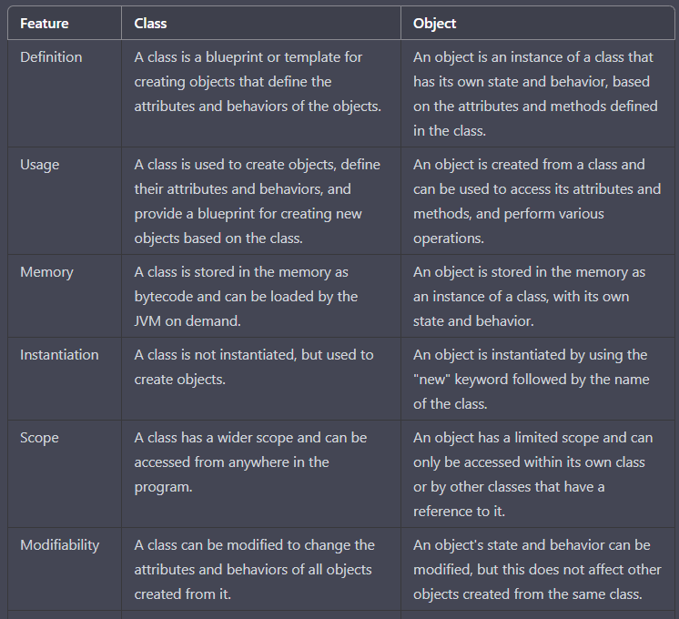
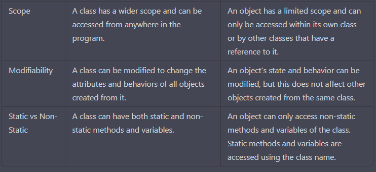

**Class vs object**

Comparison of Class and Object in Java programming in tabular form:

In summary, a class is a blueprint or template for creating objects, 
while an object is an instance of a class that has its own state and behavior. 

A class is used to create objects, define their attributes and behaviors, 
and provide a blueprint for creating new objects based on the class, 
while an object is created from a class and can be used to access its attributes and methods, 
and perform various operations. 

A class has a wider scope and can be accessed from anywhere in the program, 
while an object has a limited scope and can only be accessed within its own class or by other classes 
that have a reference to it. A class can have both static and non-static methods and variables, 
while an object can only access non-static methods and variables of the class.
