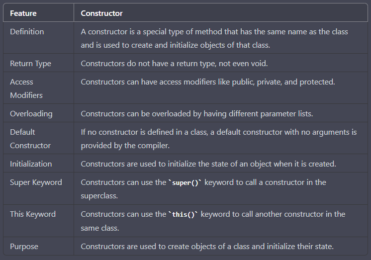
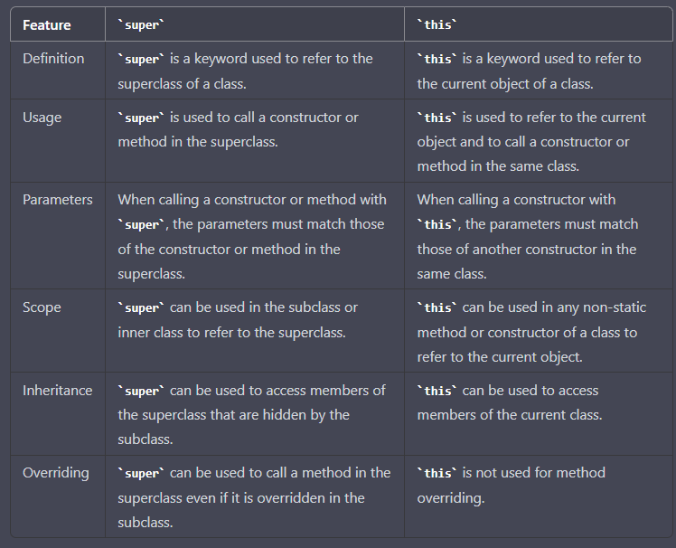

A constructor in Java is a special type of method that is used to create and initialize objects of a class.

In summary, constructors are special methods that are used to create and initialize objects of a class. They do not have a return type and can have access modifiers like public, private, and protected. Constructors can be overloaded, and the super() and this() keywords can be used to call constructors in the superclass or the same class, respectively.

**Constructor code**

public class Person {
    private String name;
    private int age;

    // Constructor with two parameters
    public Person(String name, int age) {
        this.name = name;
        this.age = age;
    }

    // Getters and setters for name and age
    public String getName() {
        return name;
    }

    public void setName(String name) {
        this.name = name;
    }

    public int getAge() {
        return age;
    }

    public void setAge(int age) {
        this.age = age;
    }
}

In this example, the Person class has a constructor that takes two parameters: name and age. 
The constructor initializes the private instance variables of the Person object using the this keyword.

The Person class also has getter and setter methods for the name and age instance variables, 
which can be used to get and set their values, respectively.

**Super vs this**

Comparison of super and this keywords in Java:

In summary, super is used to call a constructor or method in the superclass, 
while this is used to refer to the current object and to call a constructor or method in the same class. 
super is used to access members of the superclass that are hidden by the subclass, 
while this is used to access members of the current class.
