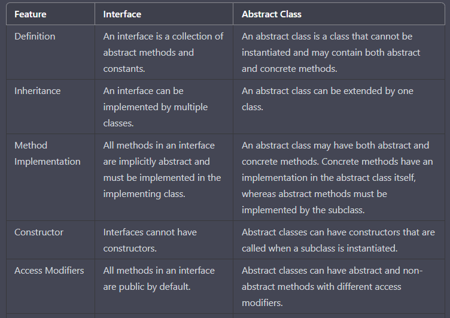
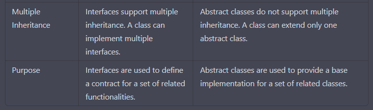
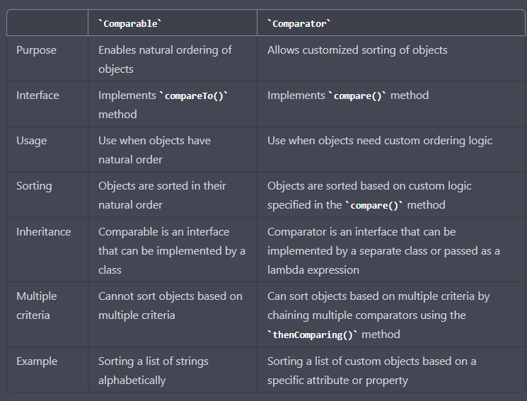

 _____________________________________________________________________________________________________________________________________________________________________

0. What is interface
_____________________________________________________________________________________________________________________________________________________________________
  
  An interface in Java is a collection of abstract methods and constants that serves as a blueprint for a set of related functionalities that 
  a class can implement.
  
  In Java, an interface is a collection of abstract methods and constants. It is a blueprint for a set of related functionalities that a class can implement.

  Interfaces can be used to define a set of methods that a class must implement, without specifying how those methods should be implemented. This allows for polymorphism and loose coupling between objects.

  To declare an interface in Java, you use the interface keyword followed by the name of the interface. For example:
   public interface MyInterface {
    public void doSomething();
    public int getSomeValue();
   }

  Here, MyInterface is an interface that declares two methods: doSomething() and getSomeValue(). Any class that implements this interface must provide an implementation for these methods.

 Classes can implement multiple interfaces, allowing them to inherit functionality from multiple sources. To implement an interface, a class must use the implements keyword, followed by the name of the interface. For example:

  public class MyClass implements MyInterface {
    public void doSomething() {
        // implementation goes here
    }
    public int getSomeValue() {
        // implementation goes here
    }
}

Here, MyClass implements the MyInterface interface and provides an implementation for the two methods declared in the interface.

_____________________________________________________________________________________________________________________________________________________________________

1. Interface vs abstract class
_____________________________________________________________________________________________________________________________________________________________________

Comparison of Interfaces and Abstract Classes in Java:

   
   
   
In summary, interfaces are used to define a set of related functionalities, 
whereas abstract classes are used to provide a base implementation for a set of related classes. 
Interfaces support multiple inheritance and have only abstract methods, 
while abstract classes can have concrete methods and do not support multiple inheritance.
_____________________________________________________________________________________________________________________________________________________________________

3. compare vs compareable in tabular form
_____________________________________________________________________________________________________________________________________________________________________

//Here's a tabular comparison of Comparator and Comparable interfaces in Java:

The Comparable interface is used to define a natural ordering for a class, such as sorting integers in ascending order or sorting strings in alphabetical order. The compareTo() method is used to compare two objects and return a negative number, zero, or a positive number depending on whether the first object is less than, equal to, or greater than the second object.

The Comparator interface, on the other hand, is used to define a custom ordering for a class, such as sorting employees by name or sorting products by price. The compare() method is used to compare two objects based on the custom ordering and return a negative number, zero, or a positive number depending on whether the first object is less than, equal to, or greater than the second object.

Both interfaces are used to sort collections or arrays of objects. The Collections.sort() and Arrays.sort() methods use the natural ordering defined by the Comparable interface by default, but can also accept a Comparator object for custom ordering. The Stream.sorted() method can also accept a Comparator object for sorting a stream of objects.
_____________________________________________________________________________________________________________________________________________________________________

2. final and non final methods in java
_____________________________________________________________________________________________________________________________________________________________________

In Java, a method can be declared with the final keyword to indicate that it cannot be overridden by any subclasses. On the other hand, a method that is not declared as final can be overridden by subclasses, unless it is declared with the private keyword.

Here are some differences between final and non-final methods in Java:

Compare vs Compareable in tabular form 

When a method is declared as final, it provides a guarantee to other developers that the behavior of the method cannot be changed by any subclass. This is useful in situations where you want to prevent a subclass from modifying the behavior of a method that is critical to the class.

In contrast, non-final methods can be overridden by subclasses, allowing them to customize or extend the behavior of the method. This is useful when you want to allow subclasses to provide their own implementation of a method, while still retaining the base behavior of the original method.

It's worth noting that the private keyword also prevents a method from being overridden, but it can only be accessed within the same class and cannot be accessed by subclasses.
_____________________________________________________________________________________________________________________________________________________________________

3. Weak hashmap
_____________________________________________________________________________________________________________________________________________________________________

A WeakHashMap is a type of Map in Java that uses weak references to its keys. Weak references allow the garbage collector to reclaim the memory occupied by an object if it is not strongly referenced by any other objects.

Here are some key points about WeakHashMap:

Keys are stored as weak references, which means that if a key is not strongly referenced by any other object, it can be garbage collected even if it is still present in the WeakHashMap.

Values are stored as strong references, which means that they are not eligible for garbage collection as long as they are associated with a key in the WeakHashMap.

WeakHashMap is not thread-safe and does not support concurrent modification during iteration. You can use Collections.synchronizedMap() to create a synchronized wrapper around a WeakHashMap.

WeakHashMap is useful for scenarios where you want to associate additional data with an object, but don't want to prevent that object from being garbage collected when it is no longer strongly referenced.

WeakHashMap can also be used for caching data that can be recomputed if it is evicted from the map due to memory pressure.
Here's an example of using a WeakHashMap:
import java.util.Map;
import java.util.WeakHashMap;

public class WeakHashMapExample {

    public static void main(String[] args) {
        Map<String, String> weakMap = new WeakHashMap<>();

        String key = "example";
        String value = "value";

        weakMap.put(key, value);

        System.out.println("Before garbage collection: " + weakMap.get(key));

        key = null; // remove strong reference to the key

        System.gc(); // trigger garbage collection

        System.out.println("After garbage collection: " + weakMap.get("example"));
    }
}

In the above example, we create a WeakHashMap and add a key-value pair to it. We then set the key variable to null to remove the strong reference to the key, which allows it to be garbage collected. We then call System.gc() to trigger garbage collection, and check whether the key-value pair is still present in the map. Since the key is no longer strongly referenced, it should be evicted from the WeakHashMap and the value should be null.

_____________________________________________________________________________________________________________________________________________________________________

**Convert string to characters**
_____________________________________________________________________________________________________________________________________________________________________

In Java, you can convert a string to an array of characters using the toCharArray() method. Here's an example:

String str = "Hello World";
char[] chars = str.toCharArray();

In this example, the toCharArray() method is called on the str string, which returns an array of characters. The resulting character array is stored in the chars variable.

You can then loop through the character array to access each individual character, like this:

for (int i = 0; i < chars.length; i++) {
    System.out.println(chars[i]);
}

This will print out each character of the string on a separate line.

_____________________________________________________________________________________________________________________________________________________________________

