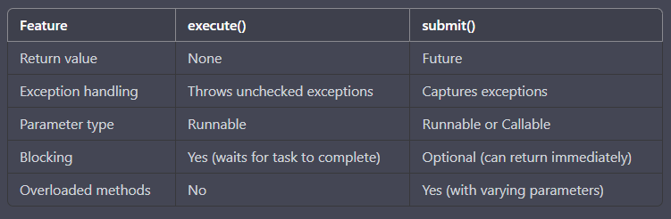

**Execute vs submit**

Tabular comparison of execute() and submit() methods in Java's ExecutorService interface:

Some additional details:

execute() and submit() are methods of the ExecutorService interface in Java, which provides a high-level interface for running tasks asynchronously.

Both methods are used to submit tasks to the executor service for execution.

execute() is a void method and does not return any value. It simply submits the task for execution and blocks until it completes.

submit() returns a Future object, which can be used to obtain the result of the task later. The Future can also be used to cancel the task or check if it has completed.

execute() throws unchecked exceptions directly from the task, while submit() captures the exceptions and returns them as part of the Future.

execute() takes a Runnable parameter, while submit() can take either a Runnable or a Callable parameter. Callable is a more powerful interface that allows the task to return a value.

execute() always blocks until the task completes, while submit() has an optional parameter to control whether to block or return immediately.

submit() has several overloaded methods that allow for more control over the task execution, such as specifying a timeout, scheduling the task for execution at a specific time, or submitting a collection of tasks at once.
