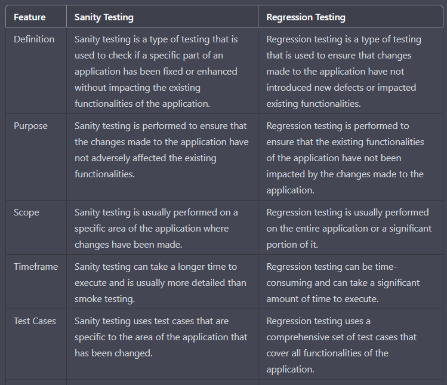
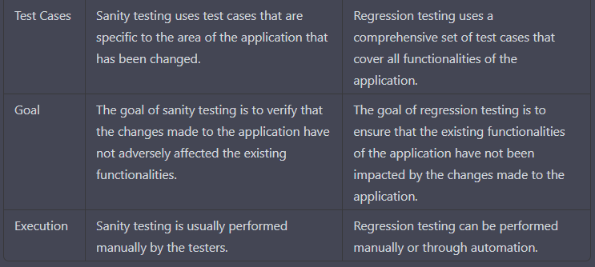

**Sanity vs regression**

Comparison of Sanity Testing and Regression Testing in software testing:

In summary, Sanity testing is a type of testing that is used to ensure that the changes made to the application 
have not adversely affected the existing functionalities, while Regression testing is used to ensure that the existing functionalities 
of the application have not been impacted by the changes made to the application. 
Sanity testing is usually performed on a specific area of the application where changes have been made, 
whereas Regression testing is usually performed on the entire application or a significant portion of it. 
Sanity testing uses test cases that are specific to the area of the application that has been changed, 
while Regression testing uses a comprehensive set of test cases that cover all functionalities of the application. 
Sanity testing is usually performed manually, while Regression testing can be performed manually or through automation.

