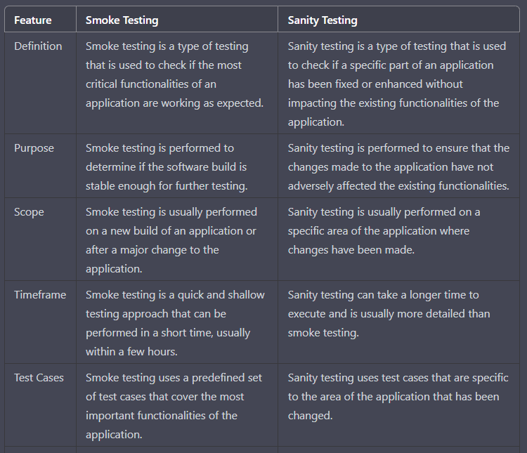
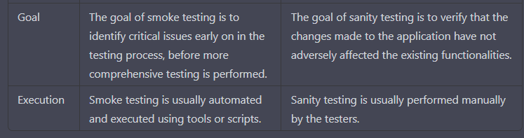

**Smoke vs sanity**

Comparison of Smoke Testing and Sanity Testing in software testing:

In summary, Smoke testing is a type of testing that is used to determine 
if the most critical functionalities of an application are working as expected, 
whereas Sanity testing is used to ensure that the changes made to the application 
have not adversely affected the existing functionalities. Smoke testing is quick and shallow, 
whereas Sanity testing can be more detailed and can take a longer time to execute. 
Smoke testing uses a predefined set of test cases, whereas Sanity testing uses test cases 
that are specific to the area of the application that has been changed.

