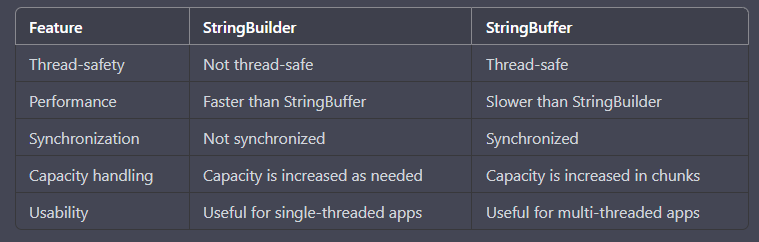

**comparison of StringBuilder and StringBuffer in Java:**

Some additional details:

StringBuilder and StringBuffer are both used to create and manipulate strings in Java.

StringBuilder is faster than StringBuffer because it is not thread-safe and does not require synchronization. 
Therefore, it is more efficient for single-threaded applications.

StringBuffer is thread-safe and therefore can be used in multi-threaded applications. 
However, the synchronization overhead can make it slower than StringBuilder.

Both classes have similar methods for manipulating strings, 
such as append(), insert(), delete(), and reverse().

StringBuilder automatically increases its capacity as needed, 
while StringBuffer increases its capacity in fixed-size chunks. 
This can make StringBuilder more memory-efficient for some use cases.

StringBuilder and StringBuffer can be used interchangeably in most cases.

